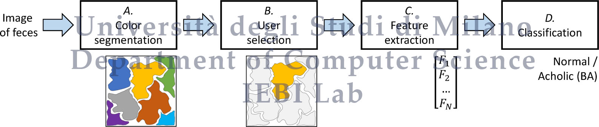
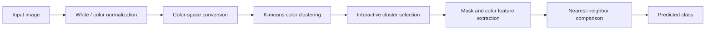
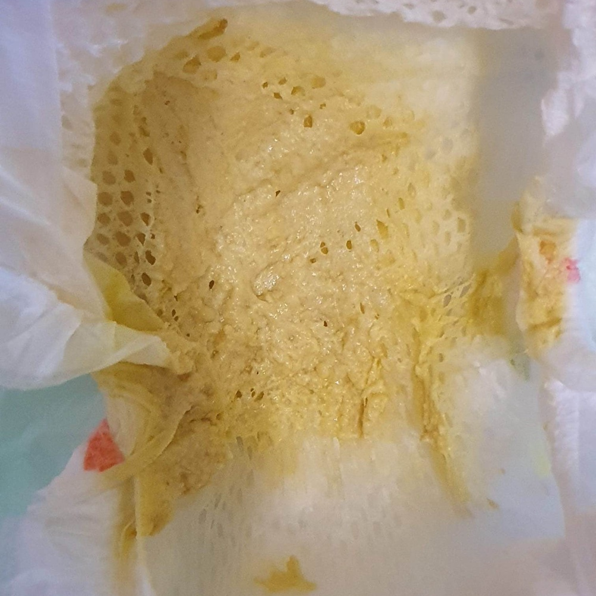
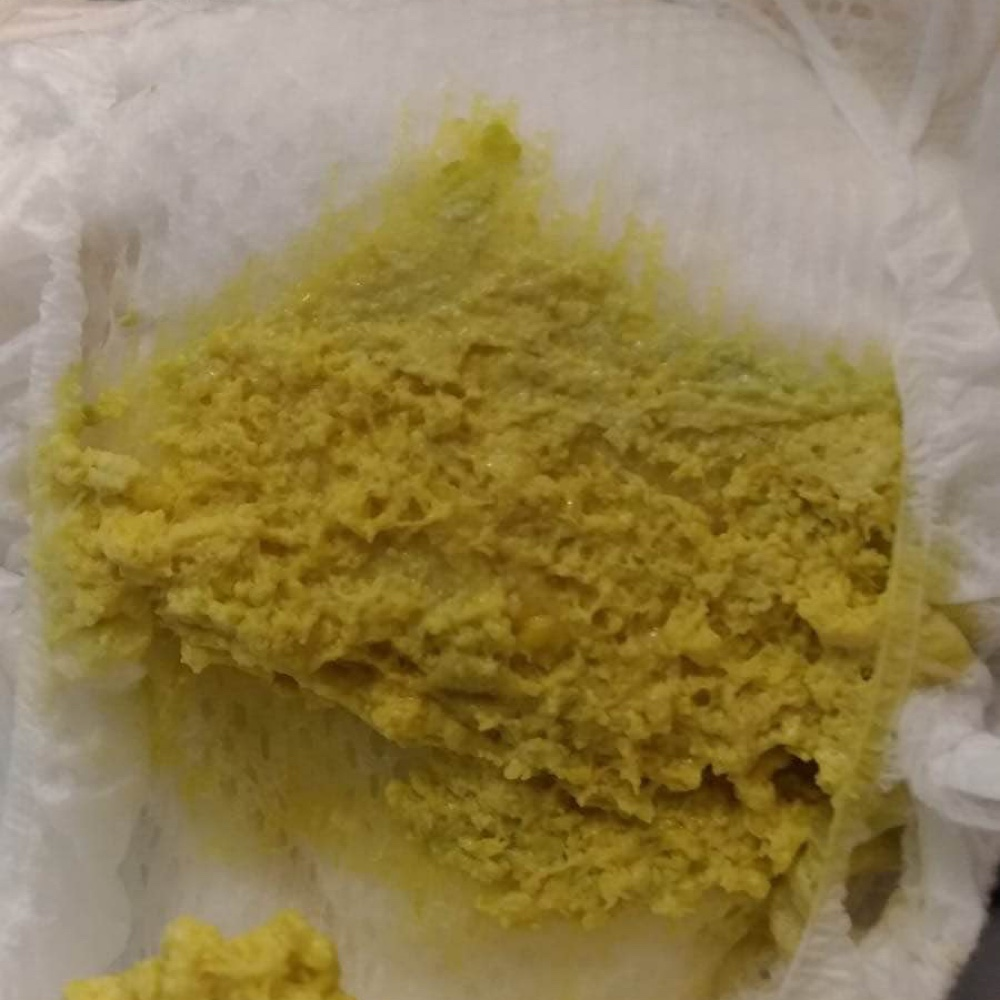
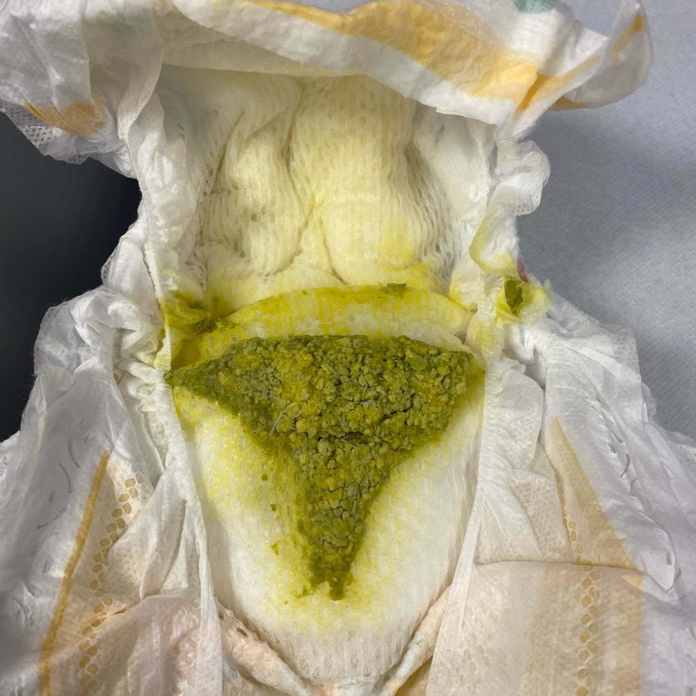
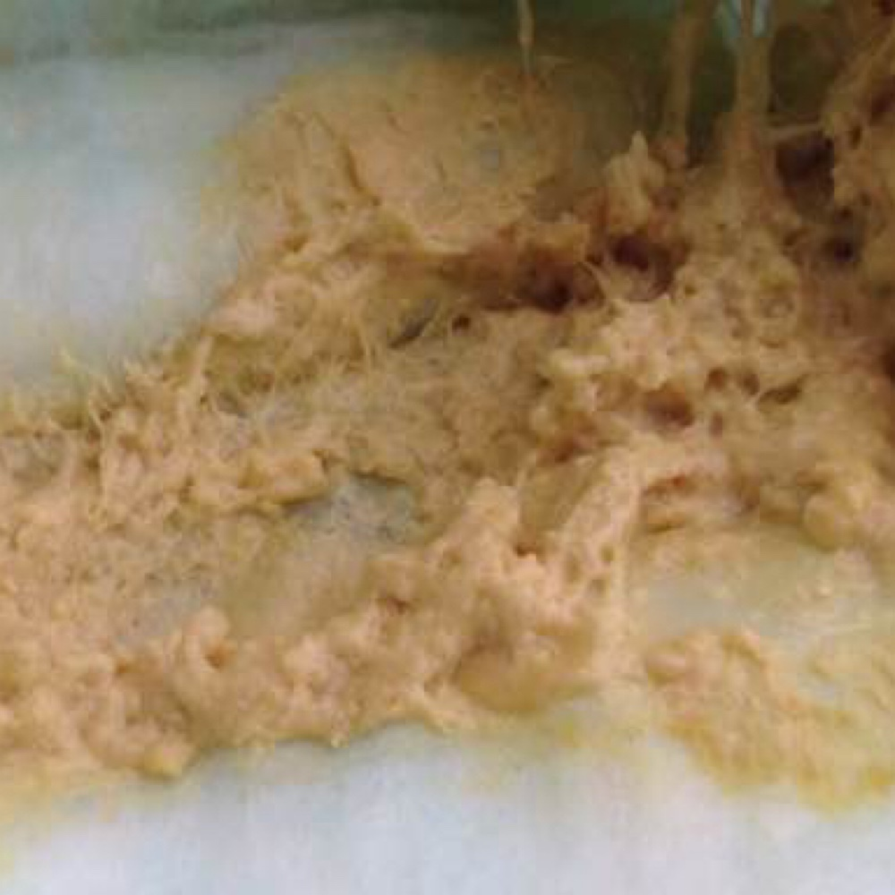

<div align="center">

# 🟡 AVB

### Biliary Atresia Detection with Interactive Color Clustering and Nearest-Neighbor Classification

[](https://www.python.org/)
[](https://pytorch.org/)
[](LICENSE)
[](#citation)
[](https://iebil.di.unimi.it/avb/index.htm)

**Python/PyTorch source code for the CIVEMSA 2022 paper**  
*Biliary atresia detection using color clustering and nearest neighbor classification: A user interactive approach*

</div>

---

## 🧠 Overview

**AVB** provides an interactive computer-vision workflow for the detection of **biliary atresia** from stool-color imagery.  
The approach is designed around color-based analysis, where images are processed through color normalization, clustering, interactive cluster selection, and nearest-neighbor classification.

The repository supports the method described in the 2022 IEEE CIVEMSA paper and includes the main experimental script together with utility functions for color-space conversion, clustering, mask processing, label handling, visualization, and similarity-based prediction.

---

## ✨ Key Features

- 🎨 **Color-driven analysis** for stool-image classification
- 🧩 **Interactive cluster selection** for user-guided decision support
- 📊 **3D color-space visualization** utilities
- 🧪 **Nearest-neighbor classification** based on color similarity
- 🖼️ Example images included in the repository
- 🐍 Lightweight Python implementation with modular helper functions

---

## 🧬 Method at a Glance

<div align="center">





</div>

---

## 🖼️ Example Images

<div align="center">
  
  
  
  
</div>

---

## 📁 Repository Structure

```text
AVB/
│
├── lanciami_AVB_test5.py          # Main script
├── functions/                     # Core processing and classification utilities
│   ├── chooseCluster.py
│   ├── chooseClusterInteractive.py
│   ├── displayImg.py
│   ├── getChannelsColor.py
│   ├── getLabel.py
│   ├── kmeans.py
│   ├── label2number.py
│   ├── morphProcMask.py
│   ├── plot3d.py
│   ├── plot3d_all.py
│   ├── predictColorSimilarity.py
│   ├── rgb2hsi.py
│   └── whiteNorm.py
│
├── imgs/                          # Example images
├── types/                         # Type / class-related resources
├── util/                          # Additional utility code
├── LICENSE
└── README.md
```

---

## 🚀 Getting Started

### 1. Clone the repository

```bash
git clone https://github.com/AngeloUNIMI/AVB.git
cd AVB
```

### 2. Create a Python environment

```bash
python -m venv .venv
```

Activate it:

```bash
# Windows
.venv\Scripts\activate

# Linux / macOS
source .venv/bin/activate
```

### 3. Install dependencies

The repository does not include a pinned `requirements.txt`, so install the common scientific Python stack used by the workflow:

```bash
pip install numpy scipy matplotlib opencv-python scikit-learn pillow torch torchvision
```

Depending on your local Python setup, you may also need additional visualization or image-processing packages used by your customized experiments.

---

## ▶️ Running the Code

Run the main script from the repository root:

```bash
python lanciami_AVB_test5.py
```

The script drives the AVB workflow, including image loading, color processing, clustering, cluster selection, and similarity-based classification.

---

## 🔬 Workflow Components

| Component | Purpose |
|---|---|
| `whiteNorm.py` | Color / white normalization |
| `rgb2hsi.py` | RGB to HSI color-space conversion |
| `kmeans.py` | Color clustering |
| `chooseCluster.py` | Automatic cluster selection helper |
| `chooseClusterInteractive.py` | User-guided cluster selection |
| `morphProcMask.py` | Mask post-processing |
| `getChannelsColor.py` | Channel and color-feature extraction |
| `predictColorSimilarity.py` | Similarity-based nearest-neighbor prediction |
| `plot3d.py`, `plot3d_all.py` | 3D visualization of color distributions |

---

## 📊 Expected Outputs

Depending on the selected configuration and data, the pipeline can produce:

- processed image views;
- color clusters and selected regions;
- 2D / 3D visualization of color distributions;
- nearest-neighbor similarity estimates;
- final predicted labels or decision-support outputs.

---

## 📚 Paper

This repository accompanies the paper:

> **A. Genovese, X. Bushi, L. D'Antiga, M. Lazzaroni, G. Mawi, E. Nicastro, V. Piuri, A. Scocciolini, F. Scotti, A. Tomarelli, and T. Vicarelli**,  
> *Biliary atresia detection using color clustering and nearest neighbor classification: A user interactive approach*,  
> Proc. of the 2022 IEEE International Conference on Computational Intelligence and Virtual Environments for Measurement Systems and Applications, CIVEMSA 2022, Chemnitz, Germany, June 15-17, 2022, pp. 1-4.

Project page:  
https://iebil.di.unimi.it/avb/index.htm

---

## 📖 Citation

If you use this code, please cite:

```bibtex
@InProceedings{civemsa22_avb,
  author    = {A. Genovese and X. Bushi and L. D'Antiga and M. Lazzaroni and G. Mawi and E. Nicastro and V. Piuri and A. Scocciolini and F. Scotti and A. Tomarelli and T. Vicarelli},
  booktitle = {Proc. of the 2022 IEEE Int. Conf. on Computational Intelligence and Virtual Environments for Measurement Systems and Applications (CIVEMSA 2022)},
  title     = {Biliary atresia detection using color clustering and nearest neighbor classification: A user interactive approach},
  address   = {Chemnitz, Germany},
  pages     = {1--4},
  month     = {June},
  day       = {15--17},
  year      = {2022},
  note      = {Accepted}
}
```

---

## 👥 Authors

- **Angelo Genovese**
- **Xhuliana Bushi**
- **Lorenzo D'Antiga**
- **Maurizio Lazzaroni**
- **Grace Mawi**
- **Emanuele Nicastro**
- **Vincenzo Piuri**
- **Alessandro Scocciolini**
- **Fabio Scotti**
- **Angela Tomarelli**
- **Tania Vicarelli**

---

## ⚠️ Medical Disclaimer

This software is research code and is not a certified medical device.  
It should not be used as a standalone diagnostic tool. Clinical decisions must always be made by qualified healthcare professionals.

---

## 📄 License

This project is released under the **GNU General Public License v3.0**.  
See the [LICENSE](LICENSE) file for details.
